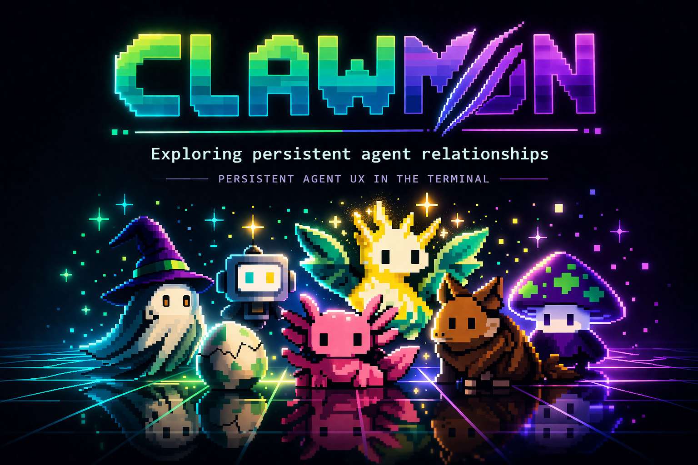

<div align="center">

# Clawmon

### Persistent agent UX in the terminal



[](https://opensource.org/licenses/MIT)

**A terminal-native system exploring whether persistent agent relationships outperform disposable chat interactions for real workflows.**

</div>

---

## What is Clawmon?

Clawmon is a companion system exploring a simple idea: AI becomes more useful when it has identity, memory, and role specialization over time.

Instead of one generic assistant, you hatch companions with distinct roles and personalities that persist across sessions, use constrained tools, and collaborate as a family. A Financial Advisor tracks your savings goals across weeks. A Career Coach notices patterns in your professional growth. A Sleep Guardian flags your late-night sessions.

The core product question: **do persistent agent relationships outperform disposable chat interactions?**

The technical challenges are memory shaping, role stability, tool ergonomics, and lifecycle design -- deciding what should be remembered, when agents should act, and how to keep them useful without becoming noisy, shallow, or gimmicky.

<div align="center">


</div>

## Quick Start

```bash
git clone https://github.com/jpinho/clawmon && cd clawmon
npm install

export ANTHROPIC_API_KEY=sk-ant-...
npx tsx src/index.ts hatch financial-advisor
```

## The Interaction Loop

The current system proves the core loop: hatch, talk, remember, recall, act.

```bash
clawmon hatch financial-advisor
```

```
  ~~ Clawmon Hatching Ceremony ~~
  Role: The Financial Advisor

     \^^^/
     .----.
    ( @  @ )
    (      )
     `----'

  Species: pyroclaw (epic)
  Name: Penny

  "Let's turn those coins into treasures!"

  [Penny has joined your family as: The Financial Advisor]
```

Every companion gets deterministic traits (Mulberry32 PRNG), an LLM-generated personality, and a unique card:

<div align="center">


</div>

### Talk naturally. The agent decides what tools to use.

```bash
clawmon "@penny I want to save 5000 euros by december"
```

```
  Penny (busy): checking the time...
  Penny (busy): counting days until 2026-12-31...
  Penny (busy): calculating "Monthly savings needed"...
  Penny (busy): remembering "Savings goal: EUR 5,000 by December 2026"...

  (@@) Penny (The Financial Advisor)

  That's about EUR 560 per month. What's this nest egg for?
  Knowing the "why" helps keep the savings fire burning!
```

Penny autonomously checked the date, calculated the monthly target, and saved the goal to memory -- all in character. Next session, she remembers.

### Interactive REPL

```bash
clawmon chat penny
```

```
  you > how's my savings goal?
  (@@) Penny
  You're aiming for EUR 5,000 by December...

  you > what about ETFs?
  Penny (busy): searching for "best ETFs Germany 2026"...
  (@@) Penny
  German investors often gravitate toward MSCI World trackers...

  you > /notes
  Penny's Notes (2)
  [goal] Savings goal: EUR 5,000 by December 2026
  [preference] Owner prefers direct financial advice
```

## Role Specialization

19 predefined roles across 5 categories. Roles are not labels -- they shape which tools the agent gets, what it pays attention to, and how it speaks.

<div align="center">


</div>

| Circle | Roles |
|--------|-------|
| **Inner Circle** | best-friend, organizer, cheerleader, memory-keeper, mirror |
| **Growth** | career-coach, financial-advisor, fitness-buddy, creative-muse, learning-guide |
| **Reflection** | journaler, relationship-coach, strategist, dream-tracker |
| **Life Skills** | sleep-guardian, social-connector |
| **Wild Cards** | philosopher, chaos-agent, companion |

### Custom Roles and Evolution

Beyond predefined roles, you can spawn a companion for any purpose:

```bash
clawmon spawn "I'm starting a business and need help staying accountable"
```

The system generates a role name, description, cadence, and skill set tailored to that purpose. Every 10 interactions, the role is re-evaluated: a companion spawned to "help me through a breakup" can naturally evolve into a "fresh start guide" as your needs shift. Evolution history is tracked -- what the role was, what it became, and why.

You can also spawn an entire team at once:

```bash
clawmon spawn-family "I'm training for a triathlon" -n 3
```

This generates complementary roles (e.g., a training planner, a nutrition advisor, a recovery coach) that work together as a family.

## Memory System

Memory is the hard problem. Clawmon uses file-based storage with typed entries -- not an opaque vector store.

```
~/.clawmon/clawmons/penny/memory/
├── MEMORY.md                    # index
├── savings-goal.md              # [goal] Save €5,000 by December
├── prefers-direct-feedback.md   # [preference] No sugar-coating
├── feelings.md                  # mood, confidence, trend (auto-updated)
└── integrity.md                 # tool success rate, interaction count
```

Each memory has a type (`observation`, `pattern`, `preference`, `fact`, `goal`, `insight`), a creation date, and plain-text content. The clawmon decides when to save -- you just talk naturally.

### Feelings and Integrity

Each companion tracks its emotional state and performance:

- **`feelings.md`** -- mood (1-10), confidence (1-10), recent outcome trend. Updated after every interaction. When confidence is low, the system prompt tells the agent to prefer straightforward approaches and aim for quick wins before tackling complex tasks.
- **`integrity.md`** -- total interactions, tool success/failure rate, notes saved, notable events. A running scorecard of reliability.

Both files are markdown with structured frontmatter -- human-readable and Obsidian-compatible.

### Family Memory Structure

When using an Obsidian vault, family members share a parent folder:

```
vault/clawmon/
└── training-for-a-triathlon/     # family name
    ├── coach/                    # companion memories
    ├── nutritionist/
    └── recovery-guide/
```

### Obsidian Integration

Memory files are markdown with YAML frontmatter and tags -- already Obsidian-compatible. Point clawmon at your vault and memories show up as navigable, searchable, graph-linked notes alongside your own:

```bash
clawmon config memoryRoot /path/to/your/obsidian-vault/clawmon
```

No Obsidian? No problem. Memories default to `~/.clawmon/` and work the same way.

See [MEMORY-DESIGN.md](MEMORY-DESIGN.md) for the full design: what gets stored, what gets summarized, what gets forgotten, and how memory stays useful instead of decaying into noise.

## Safety and Behavior Boundaries

Persistent agents with memory need tighter constraints than stateless chatbots. Clawmon defines boundaries around:

- When an agent should refuse to act
- When it should ask instead of assuming
- When it should not store memory
- How role constraints prevent overreach

See [SAFETY.md](SAFETY.md) for the full behavioral specification.

## Skill System

Skills are constrained by role. A Financial Advisor gets `calculator` + `web_search`. A Best Friend gets only `save_note` + `date_time`. The agent decides when to use tools -- up to 5 agentic iterations per message.

```
  Penny's Skills (The Financial Advisor)

  calculator    -- math, budgets, compound interest
  web_search    -- current prices, rates, comparisons (via Brave API)
  date_time     -- date calculations, deadline tracking
  save_note     -- remember important things about you
```

## Proactive Behavior

Clawmons shouldn't wait for you to remember them. With Claude Code hooks, your primary companion shows up automatically.

### Session hooks

**SessionStart** -- your primary clawmon's context (role, feelings, active goals, recent observations) is automatically injected when you open Claude Code. No AI call. Instant.

**SessionEnd** -- when you close Claude Code, your primary clawmon reads the transcript and extracts relevant observations, saving them as memories. One cheap Sonnet call, happens in the background.

```bash
# Pick which clawmon greets and observes
clawmon primary penny

# Add hooks to ~/.claude/settings.json (see skills/claude-code-hooks/)
```

Full setup in [skills/claude-code-hooks/](skills/claude-code-hooks/README.md).

### Scheduled behavior (coming soon)

<div align="center">


</div>

A Financial Advisor checks deposit rates every Monday. A Career Coach reviews your week. You wake up and your family has already left you notes.

The design challenge: proactive agents must be useful without being noisy. See [SAFETY.md](SAFETY.md) for the intervention boundaries.

## Evaluation Framework

Even lightweight evals matter for persistent agent systems. Clawmon tracks:

- **Role consistency** -- does the agent stay in character across sessions?
- **Recall usefulness** -- are stored memories retrieved at the right time?
- **Tool-choice correctness** -- does the agent pick the right skill?
- **Session-to-session continuity** -- does context carry over meaningfully?

See [EVALS.md](EVALS.md) for the evaluation framework and methodology.

## MCP Integration

Clawmon runs as an MCP server, exposing 16 tools to any MCP-compatible host. Talk to your clawmons inside Claude Code, or any other MCP client:

```bash
claude mcp add clawmon -- bash ~/clawmon/bin/clawmon-mcp.sh
```

| Category | Tools | AI Call? |
|----------|-------|---------|
| **Conversation** | `talk_to_clawmon`, `talk_to_family` | Yes (Opus) |
| **Fast context** | `clawmon_context`, `save_session` | No -- instant |
| **Creating** | `hatch_clawmon`, `spawn_clawmon`, `spawn_family`, `shuffle_clawmon` | Yes (Sonnet) |
| **Viewing** | `show_clawmon`, `family`, `clawmon_notes`, `clawmon_skills`, `clawmon_roles` | No |
| **Config** | `clawmon_config`, `clawmon_export`, `show_clawmon_help` | No |

The fast tools (`clawmon_context`, `save_session`) skip the AI entirely -- they read/write files directly. Use them for session context loading and end-of-session note capture without the latency of a nested LLM call.

### Claude Code Skill

Install the bundled skill so Claude Code knows how to use clawmon tools:

```bash
cp -r skills/claude-code ~/.claude/skills/clawmon
```

This teaches Claude Code the full tool surface, recommended workflows (load context at session start, save observations at session end), and when to use fast tools vs the full agentic loop.

## Commands

```bash
# Hatching
clawmon hatch                           # see role suggestions
clawmon hatch financial-advisor         # hatch with a specific role
clawmon roles                           # list all 19 available roles

# Talking
clawmon "@penny how's my budget?"       # one-shot with @mention
clawmon "hey, how are you?"             # routes to first clawmon
clawmon chat penny                      # interactive REPL
clawmon talk penny "quick question"     # explicit one-shot

# Viewing
clawmon family                          # see all your clawmons
clawmon show penny                      # full card with sprite and stats
clawmon notes penny                     # see collected observations
clawmon skills penny                    # see available skills

# Managing
clawmon shuffle penny                   # regenerate name/personality, keep memories
clawmon export penny                    # export to JSON
clawmon import penny.json               # import from JSON

# Config
clawmon config                          # view current settings
clawmon config memoryRoot /path/to/vault  # set Obsidian vault path
clawmon config memoryRoot reset         # reset to default
clawmon primary                         # view primary clawmon
clawmon primary penny                   # set primary (greets + observes sessions)

# Session hooks (called by Claude Code automatically -- see skills/claude-code-hooks/)
clawmon session-start                   # outputs primary clawmon's context
clawmon session-end                     # extracts observations from transcript

# Debug
clawmon --debug "@penny hello"          # verbose output for troubleshooting
```

## Tech Stack

| Layer | Technology |
|-------|-----------|
| **Language** | TypeScript (strict mode, ES2022) |
| **Runtime** | Node.js with tsx for development |
| **AI** | Claude Opus 4.6 (chat), Sonnet (soul generation) via Anthropic SDK |
| **CLI** | Commander.js + Chalk for colored terminal output |
| **Search** | Brave Search API |
| **Storage** | File-based -- JSON state, Markdown + YAML frontmatter for memories |
| **MCP** | Model Context Protocol SDK (stdio transport) |
| **Secrets** | 1Password CLI (`op run`) -- no plaintext .env files |
| **Testing** | Vitest (70%+ coverage) |

## Documentation

| Document | What it covers |
|----------|---------------|
| [ARCHITECTURE.md](ARCHITECTURE.md) | System design, module graph, data flows, data model |
| [MEMORY-DESIGN.md](MEMORY-DESIGN.md) | Memory storage, retrieval, summarization, decay |
| [SAFETY.md](SAFETY.md) | Behavior boundaries, refusal, memory constraints |
| [EVALS.md](EVALS.md) | Evaluation framework for persistent agent quality |
| [BACKLOG.md](BACKLOG.md) | Prioritized task list and MVP gap analysis |

## Secrets

Clawmon needs two API keys. No plaintext `.env` files -- use your preferred secret manager.

- `ANTHROPIC_API_KEY` -- Claude API (Opus 4.6 for chat, Sonnet for soul generation)
- `BRAVE_API_KEY` -- Brave Search API (free at brave.com/search/api)

```bash
# 1Password CLI (preferred)
op run --env-file .env.op --account <your-account-id> -- npx tsx src/index.ts chat penny

# Or set environment variables directly
export ANTHROPIC_API_KEY=sk-ant-...
export BRAVE_API_KEY=BSA...

npx clawmon chat penny

# or if running the code locally
npx tsx src/index.ts chat penny
```

## License

[MIT](LICENSE)

---

<div align="center">

Built with love by [jpinho](https://pandemicode.dev/about)

</div>
